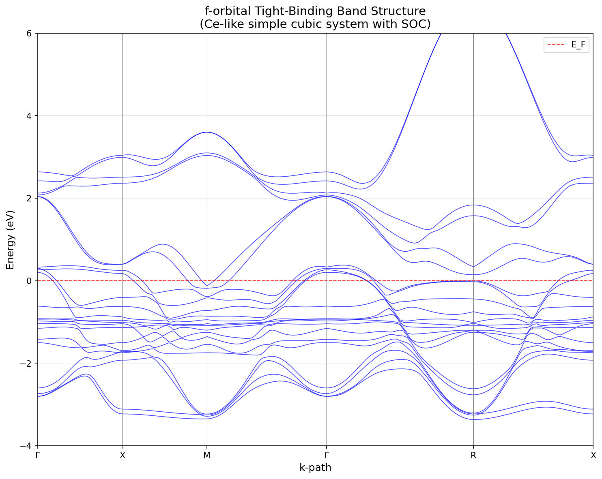
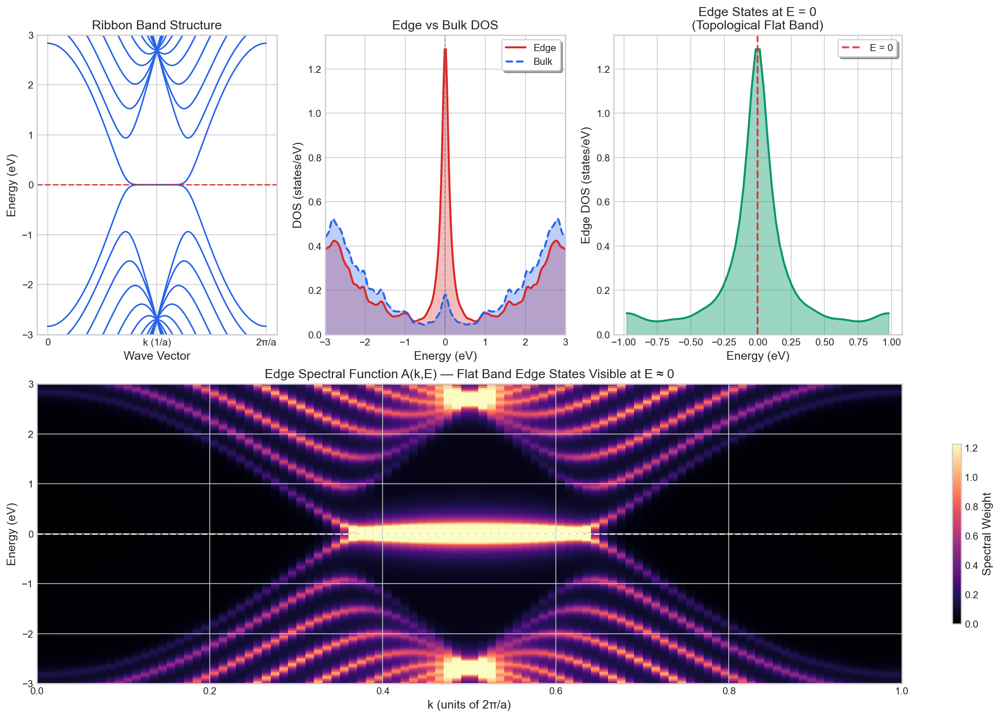

<p align="center">
  
</p>

<p align="center">
  <a href="https://www.python.org/"></a>
  <a href="https://pysktb.readthedocs.io"></a>
  <a href="https://github.com/santoshkumarradha/pysktb/issues"></a>
  <a href="https://opensource.org/licenses/MIT"></a>
  <a href="https://zenodo.org/badge/latestdoi/255115236"></a>
</p>

<p align="center">
  <b>Slater-Koster tight-binding Hamiltonians for 1D, 2D, and 3D systems</b><br>
  <sub>From topological insulators to strongly correlated f-electron materials</sub>
</p>

<p align="center">
  <a href="https://pysktb.readthedocs.io">Documentation</a> •
  <a href="#installation">Installation</a> •
  <a href="#examples">Examples</a> •
  <a href="#citation">Citation</a>
</p>

---

## Installation

```bash
pip install pysktb
```

For the latest development version (includes f-orbital support):

```bash
git clone https://github.com/santoshkumarradha/pysktb.git
cd pysktb
pip install -e .
```

## Quick Start

```python
from pysktb import Lattice, Atom, Structure, Hamiltonian

# Define lattice and atoms
lattice = Lattice([[1, 0, 0], [0, 1, 0], [0, 0, 1]], a=3.5)
atom = Atom("X", [0, 0, 0], orbitals=["s", "px", "py", "pz"])
structure = Structure(lattice, [atom], bond_cut={"XX": {"NN": 3.6}})

# Set up Hamiltonian and solve
params = {"X": {"e_s": 0, "e_p": 1.5}, "XX": {"V_sss": -0.5, "V_sps": 0.5, "V_pps": 0.8, "V_ppp": -0.2}}
ham = Hamiltonian(structure, params)
kpts, kpts_dist, spl_pnts = ham.get_kpts([[0,0,0], [0.5,0.5,0.5]], nk=50)
eigenvalues = ham.solve_kpath(kpts)
```

## Features

<table>
<tr>
<td width="50%">

**Orbital Basis**
- s, p, d, and f orbitals
- Arbitrary orbital combinations
- Slater-Koster parametrization

**Spin Physics**
- Spin-polarized calculations
- Spin-orbit coupling (p, d, f)
- Magnetic systems

</td>
<td width="50%">

**Structure Support**
- 1D, 2D, and 3D systems
- Beyond nearest-neighbor interactions
- [pymatgen](https://pymatgen.org) integration

**Performance**
- JIT compiled with [numba](https://numba.pydata.org)
- k-point parallelization
- Total energy calculations

**Green's Functions**
- DOS with Lorentzian broadening
- Local DOS (atom/orbital resolved)
- Spectral function A(k,E)
- Topological edge states

</td>
</tr>
</table>

## Examples

Full examples in [examples.ipynb](./docs/source/examples/data/examples.ipynb)

<table>
<tr>
<td align="center" width="33%">
<br>
<sub><b>Graphene</b><br>Band structure & BZ colorplot</sub>
</td>
<td align="center" width="33%">
<br>
<sub><b>Halide Perovskites</b><br>Rashba SOC effect</sub>
</td>
<td align="center" width="33%">
<br>
<sub><b>Lanthanides</b><br>f-orbital with SOC</sub>
</td>
</tr>
</table>

<details>
<summary><b>More examples</b></summary>

<br>

**1D sp-chain (SSH model)** — Topological crystalline insulator

<table>
<tr>
<td align="center"><br><sub>Band structure</sub></td>
<td align="center"><br><sub>Orbital projection</sub></td>
<td align="center"><br><sub>Density of states</sub></td>
</tr>
</table>

**Buckled Antimony** — Topological states

<table>
<tr>
<td align="center"><br><sub>Dirac cone merging<br><a href="https://arxiv.org/abs/1912.03755">arXiv:1912.03755</a></sub></td>
<td align="center"><br><sub>Higher-order topology<br><a href="https://arxiv.org/abs/2003.12656">arXiv:2003.12656</a></sub></td>
<td align="center"><br><sub>Surface states with SOC</sub></td>
</tr>
</table>

**f-orbital Systems** — See [f_orbital_example.py](./docs/source/examples/f_orbital_example.py) for Cerium-like lanthanide implementation with 4f electrons and spin-orbit coupling.

**Green's Function DOS** — Graphene DOS and LDOS via Green's functions


See [greens_dos_example.py](./docs/source/examples/greens_dos_example.py) for computing DOS with physical Lorentzian broadening and sublattice-resolved LDOS.

**Edge States** — Topological edge states in graphene zigzag ribbon



See [edge_states_example.py](./docs/source/examples/edge_states_example.py) for computing edge spectral functions and visualizing flat-band edge states at E=0.

</details>

## Performance

<table>
<tr>
<td align="center" width="50%">
<br>
<sub>JIT compilation speedup</sub>
</td>
<td align="center" width="50%">
<br>
<sub>k-point parallelization</sub>
</td>
</tr>
</table>

## Roadmap

| Status | Feature |
|:------:|---------|
| ◐ | Complete pymatgen integration |
| ◐ | Berry phase calculation |
| ○ | Bogoliubov-de-Gennes (BdG) for superconductivity |
| ○ | [ASE](https://wiki.fysik.dtu.dk/ase/) structure interface |
| ● | Green's function DOS |
| ● | Topological edge states |
| ○ | Sympy analytical matrix elements |
| ○ | Low-energy k.p Hamiltonian extraction |

<sub>● complete · ◐ in progress · ○ planned</sub>

## Citation

If you use this code in your research, please cite:

```bibtex
@misc{pysktb,
  doi       = {10.5281/ZENODO.4311595},
  url       = {https://zenodo.org/record/4311595},
  author    = {Radha, Santosh Kumar},
  title     = {pysktb: Tight-binding electronic structure codes},
  publisher = {Zenodo},
  year      = {2020}
}
```

## License

[MIT](LICENSE)
