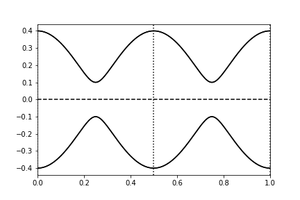
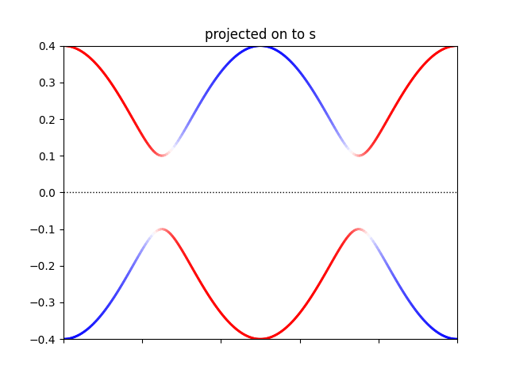
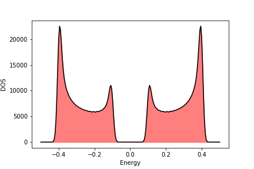
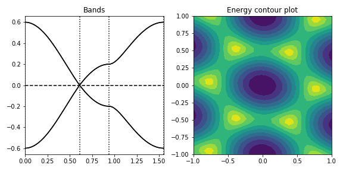
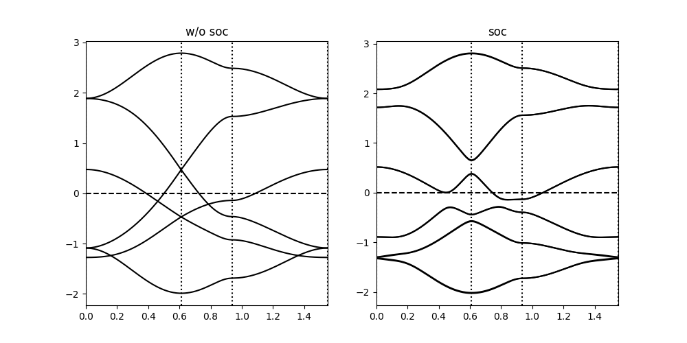
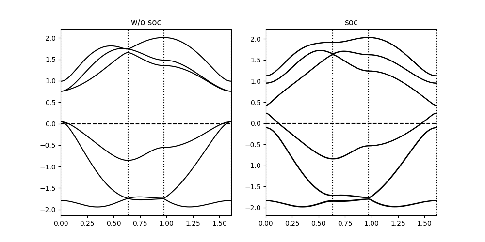
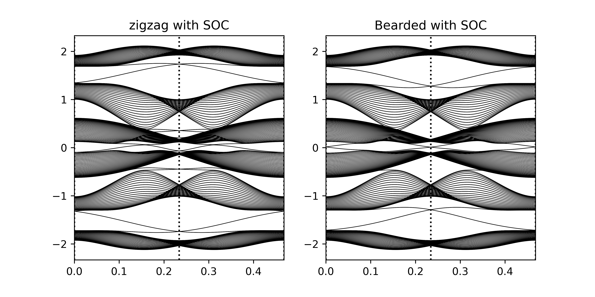
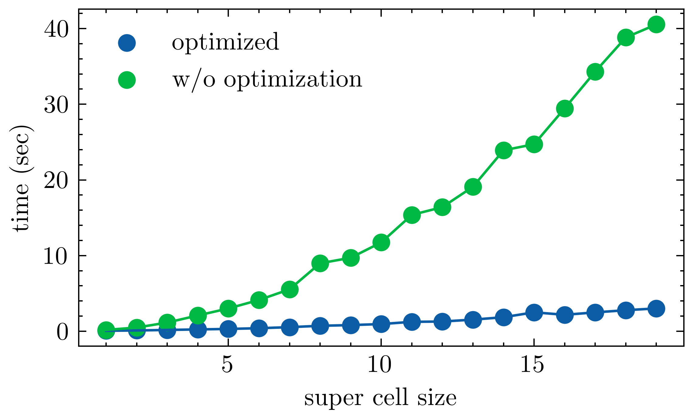

i

Scientific Python package for solving Slater Koster tight-binding hamiltonian
                            

A python package in development for creating and solving slater koster tight-binding hamiltonians for various 1D 2D and 3D systems.

### Features

  - Generate s,p,d interactions in any given lattice
  - Total energy *for insulators and semimetals*
  - Specify range of interaction with more then Nearest neibghor
  - Spin Polarized calculations
  - Spin orbit coupling *(only for p orbitals as of now)*
  - Plot orbital weighted colorplots
  - Integration with [pymatgen](https://pymatgen.org) structres 
  - JIT optimized with numba
  - Parallelization on kpoints

### Installation
 1. Copy the files _params.py and pysktb.py to the working directory
 2. Install the modules in requirements.txt.
 ```console
 pip install -U -r requirements.txt
 ```
 3. Import them and use !

 
### Examples

Example usage shown in 	[examples.ipynb](./examples/examples.ipynb)
1. 1D chain of sp (example of 1D topological Crystiline insulator *SSH*)
  
  - with orbital projection on s
  
  - DOS
  
2. Graphene and band colorplot in BZ
  
3. Buckled antimony Sb 
   - preprint of Dirac cones merging in 2D Sb https://arxiv.org/abs/1912.03755
   
   - preprint of Higher Order Topological states in 2D Sb https://arxiv.org/abs/2003.12656
   
4. Low buckled Sb Surface states with SOC - Topological Crystalline Insulator
 


### Optimized 
  - with `jit`

- Parallelized over k


### Features to be added
   - ~Parallelization on kpoints~ and orbitals.
   - ~scipy sparse matrix optimized~
   - Spin Orbit Coupling for d,f
   - Bogoliubov-de-Gennes (BdG) solutions for the given system for Superconductivity 
   - Interface with [ASE](https://wiki.fysik.dtu.dk/ase/) structures
   - Create finite structures and slabs for Topological calculations within the code *(requires pymatgen right now)*
   - Berry phase calculation (high on priority)
   - Greens function DOS
   - Convert all operations to sympy, so that one can output analytical Tightbinding matrix elements for ease of access 

