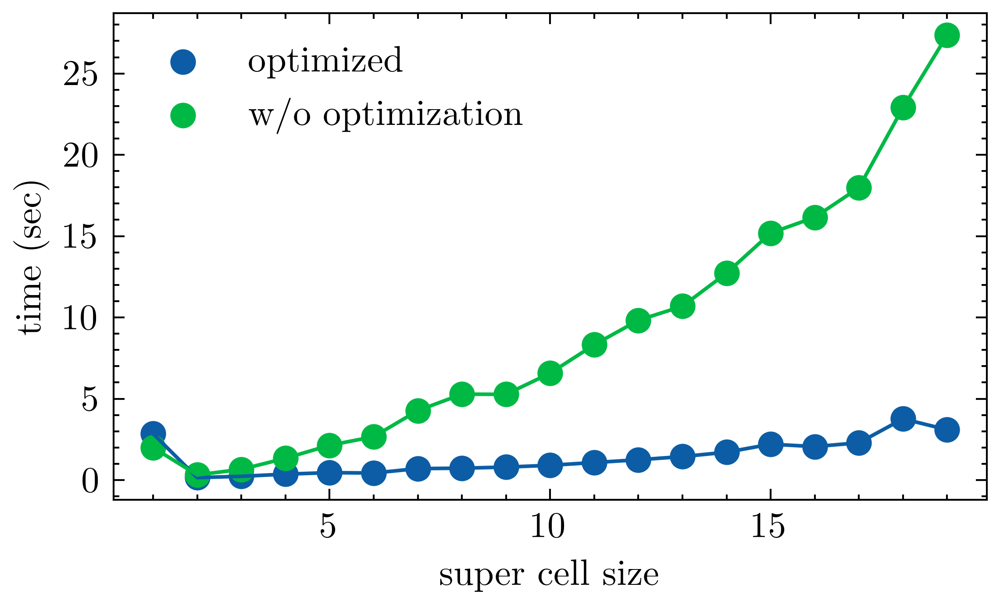

<p align="center"></p>


&nbsp;&nbsp;&nbsp;&nbsp;&nbsp;&nbsp;&nbsp;&nbsp;&nbsp;&nbsp;&nbsp;&nbsp;&nbsp;&nbsp;&nbsp;&nbsp;&nbsp;&nbsp;&nbsp;

[](https://travis-ci.org/anfederico/Clairvoyant)

[](https://github.com/anfederico/Clairvoyant/issues)

[](https://opensource.org/licenses/MIT)

<p align="center">Scientific Python package for solving Slater Koster tight-binding hamiltonian. A python package in development for creating and solving slater koster tight-binding hamiltonians for various 1D 2D and 3D systems from topological insulators to strong correlations.</p>


## Documentation

Documentation can be found at [https://pysktb.readthedocs.io](https://pysktb.readthedocs.io/en/latest/)

## Features

  - Generate s,p,d interactions in any given lattice
  - Total energy *for insulators and semimetals*
  - Specify range of interaction with more then Nearest neibghor
  - Spin Polarized calculations
  - Spin orbit coupling *(only for p orbitals as of now)*
  - Plot orbital weighted colorplots
  - Integration with [pymatgen](https://pymatgen.org) structres 
  - JIT optimized with numba
  - Parallelization on kpoints

## Installation
```console
pip install pysktb
```

 
## Examples

Example usage shown in 	[examples.ipynb](./docs/source/examples/data/examples.ipynb)


1. 1D chain of sp (example of 1D topological Crystiline insulator *SSH*)
  
 
  
  - with orbital projection on s
  
  
  - DOS
  
  
  
2. Graphene and band colorplot in BZ

  
  
2. Intrinsic Spin-Orbit-Coupling Rashba effect in Halide Perovskites

  
  
3. Buckled antimony Sb 

   - preprint of Dirac cones merging in 2D Sb https://arxiv.org/abs/1912.03755
   
   
   
   - preprint of Higher Order Topological states in 2D Sb https://arxiv.org/abs/2003.12656
   
   
   
4. Low buckled Sb Surface states with SOC - Topological Crystalline Insulator

 
 


## Optimized 
  - with `jit`

- Parallelized over k


## Features to be added
   - Complete pymatgen integration (high on priority)
   - Berry phase calculation (high on priority) *already implemented need to interface*
   - ~Parallelization on kpoints~ and orbitals.
   - ~scipy sparse matrix optimized~
   - Spin Orbit Coupling for d,f
   - Bogoliubov-de-Gennes (BdG) solutions for the given system for Superconductivity 
   - Interface with [ASE](https://wiki.fysik.dtu.dk/ase/) structures
   - Create finite structures and slabs for Topological calculations within the code *(requires pymatgen right now)*
   - Greens function DOS
   - Convert all operations to sympy, so that one can output analytical Tightbinding matrix elements for ease of access 
   - Low energy k.p hamiltonian from sympy
   
## Citation
If you are using the code, please consider citing it with the followig bib
[](https://zenodo.org/badge/latestdoi/255115236)
```python
@misc{https://doi.org/10.5281/zenodo.4311595,
  doi = {10.5281/ZENODO.4311595},
  url = {https://zenodo.org/record/4311595},
  author = {Radha,  Santosh Kumar},
  title = {santoshkumarradha/pysktb: Tightbinding Electronic structure codes},
  publisher = {Zenodo},
  year = {2020},
  copyright = {Open Access}
}
```
   
## License

[MIT](LICENSE) 
