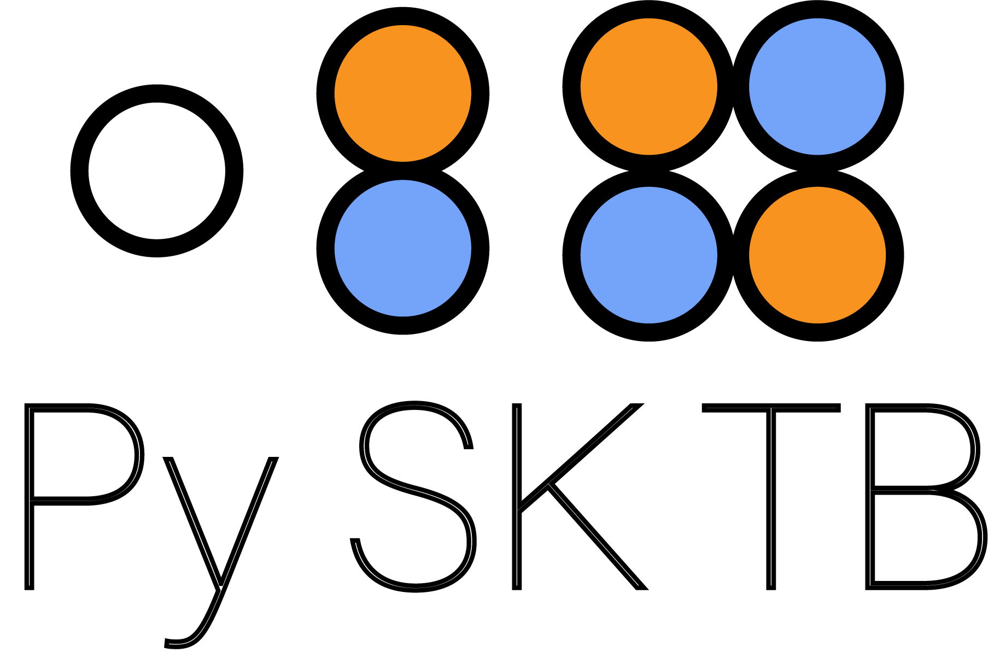

<p align="center"></p>

<p align="center">
  <a href="https://www.python.org/"></a>
  <a href="https://github.com/santoshkumarradha/pysktb/issues"></a>
  <a href="https://opensource.org/licenses/MIT"></a>
  <a href="https://zenodo.org/badge/latestdoi/255115236"></a>
</p>

<p align="center">Scientific Python package for creating and solving Slater-Koster tight-binding Hamiltonians for 1D, 2D, and 3D systems — from topological insulators to strongly correlated materials.</p>

---

## Documentation

Full documentation at [pysktb.readthedocs.io](https://pysktb.readthedocs.io/en/latest/)

## Features

- Generate **s, p, d, and f orbital** interactions in any given lattice
- Total energy calculations *for insulators and semimetals*
- Specify interaction range beyond nearest neighbors
- Spin polarized calculations
- Spin-orbit coupling for p, d, and f orbitals
- Orbital-weighted band structure plots
- Integration with [pymatgen](https://pymatgen.org) structures
- JIT optimized with [numba](https://numba.pydata.org)
- Parallelization over k-points

## Installation

```console
pip install pysktb
```

## Examples

Example usage shown in [examples.ipynb](./docs/source/examples/data/examples.ipynb)

### 1D sp-chain (SSH model)

Topological crystalline insulator with s-p hybridization


With orbital projection on s orbital:


Density of states:


### Graphene

Band structure and colorplot in Brillouin zone


### Halide Perovskites with SOC

Intrinsic spin-orbit coupling and Rashba effect


### Buckled Antimony (Sb)

Dirac cone merging in 2D Sb ([arXiv:1912.03755](https://arxiv.org/abs/1912.03755))


Higher-order topological states in 2D Sb ([arXiv:2003.12656](https://arxiv.org/abs/2003.12656))


Surface states with SOC — Topological Crystalline Insulator


### f-orbital Systems (Lanthanides)

Cerium-like system with 4f electrons and spin-orbit coupling. Narrow f-bands characteristic of localized 4f electrons with SOC-induced splitting.


See [examples/f_orbital_example.py](./examples/f_orbital_example.py) for the full implementation.

## Performance

JIT compilation with numba:


Parallelization over k-points:


## Roadmap

- Complete pymatgen integration
- Berry phase calculation *(implemented, needs interface)*
- Parallelization over orbitals
- Bogoliubov-de-Gennes (BdG) for superconductivity
- Interface with [ASE](https://wiki.fysik.dtu.dk/ase/) structures
- Finite structures and slabs for topological calculations
- Green's function DOS
- Sympy integration for analytical tight-binding matrix elements
- Low-energy k.p Hamiltonian extraction

## Citation

If you use this code, please cite:

```bibtex
@misc{https://doi.org/10.5281/zenodo.4311595,
  doi = {10.5281/ZENODO.4311595},
  url = {https://zenodo.org/record/4311595},
  author = {Radha, Santosh Kumar},
  title = {santoshkumarradha/pysktb: Tightbinding Electronic structure codes},
  publisher = {Zenodo},
  year = {2020},
  copyright = {Open Access}
}
```

## License

[MIT](LICENSE)
